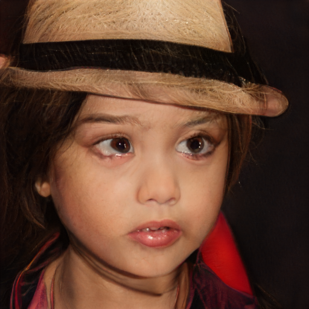

<div align="center">

<h1><a href="https://arxiv.org/abs/xxxx.xxxxx">DiffPrivate: Facial Privacy Protection with Diffusion Models</a></h1>

**[Minh-Ha Le](mailto:minh-ha.le@liu.se), [Niklas Carlsson](mailto:niklas.carlsson@liu.se)**


[](#license)
<!--
[](https://arxiv.org/abs/xxxx.xxxxx)
-->
</div>

### Share us a :star: if this repo helps you!

This repository is the official implementation of **DiffPrivate**. If you have any questions, please feel free to contact us. You can create an issue or send an email to [minh-ha.le@liu.se](mailto:minh-ha.le@liu.se). We welcome any ideas, exchanges, and discussions.

## Updates

[**12/15/2024**] Code is public.
<!--
[**MM/DD/YYYY**] Paper is publicly accessible on [ArXiv](https://arxiv.org/abs/xxxx.xxxxx).
-->
[**12/01/2024**] Initial release.

## Table of Contents

- Abstract
- Requirements
- Usage
- Results
- Citation & Acknowledgments
- License

## Abstract

**DiffPrivate** is a novel framework for facial privacy protection using diffusion models. By leveraging the generative capabilities of diffusion models, we create privacy-preserving transformations of facial images that protect personal identity while maintaining visual realism. Our approach ensures that the protected images are imperceptible to human observers but effectively prevent recognition by facial recognition systems.


## Requirements

1. **Hardware Requirements**
   - GPU: At least one NVIDIA GPU with 16GB memory or more.

2. **Software Requirements**
   - Python 3.8
   - CUDA 11.3
   - cuDNN 8.4.1

   To install the required Python packages, run:

   ```bash
   pip install torch==1.12.1+cu113 torchvision==0.13.1+cu113 torchaudio==0.12.1+cu113 -f https://download.pytorch.org/whl/torch_stable.html
   pip install -r requirements.txt
   ```

3. **Datasets**
   - Sample datasets are provided in the `demo` directory for quick testing.
   - For comprehensive experiments, use your own facial image datasets or public datasets compatible with the framework.

4. **Pre-trained Models**
   - **Stable Diffusion**: We use Stable Diffusion 2.0 as the diffusion model. Load it by setting `pretrained_diffusion_path="stabilityai/stable-diffusion-2-base"` in `config.yaml`

5. **Additional Dependencies for DiffPrivate Edit**
   - For **DiffPrivate Edit**, clone the [DiffAE repository](https://github.com/minha12/DiffAE.git) into the `./src/` directory:

     ```bash
     git clone https://github.com/minha12/DiffAE.git ./src/DiffAE
     ```

## Usage

### Crafting Privacy-Protected Images

To generate privacy-protected images using **DiffPrivate Perturb**, run:

```bash
python run-dpp.py paths.images_root=<path_to_images> paths.save_dir=<save_path>
```

- Replace `<path_to_images>` with the path to your images.
- Replace `<save_path>` with the directory where you want to save the results.

Examples:

```bash
python run-dpp.py paths.images_root=./data/demo/images paths.save_dir=./data/output
```

The results, including the protected images and logs, will be saved in the specified `save_dir`.

### Evaluation

To evaluate the effectiveness of the privacy protection against facial recognition models, run:

```bash
python evaluate.py \
  evaluation.folder_type=single \
  evaluation.data_folder=<path_to_protected_images> \
  evaluation.log_dir=<path/to_save_logs>
```

- Replace `<path_to_protected_images>` with the path to the generated protected images.
- Replace `<path/to_save_logs>` with the directory to save evaluation results.

## Results

<!-- Image grid -->
|                | Image 1                                 | Image 2                                 | Image 3                                 | Image 4                                 | Image 5                                 | Image 6                                 | Image 7                                 |
|----------------|-----------------------------------------|-----------------------------------------|-----------------------------------------|-----------------------------------------|-----------------------------------------|-----------------------------------------|-----------------------------------------|
| **Input**      |               |               |               |               |               |               |               |
| **CW [1]**     |            |            |            |            |            |            |            |
| **PGD [2]**    |           |           |           |           |           |           |           |
| **Fawkes [3]** |  |  |  |  |  |  |  |
| **AMT-GAN [4]**|           |           |           |           |           |           |           |
| **StyleAdv [5]**|     |      |      |      |      |      |      |
| **DiffPrivate Edit**|     |          |          |          |          |          |          |
| **DiffPrivate Perturb**| |    |       |       |       |       |       |

**Figure:** Visualizations of the protected face images generated by different face protection methods on CelebA-HQ.

## Citation & Acknowledgments

If you find this work useful in your research, please consider citing:

```bibtex
@article{le2023diffprivate,
  title={DiffPrivate: Facial Privacy Protection with Diffusion Models},
  author={Le, Minh-Ha and Carlsson, Niklas},
  booktitle={Proceedings on Privacy Enhancing Technologies (PoPETs)},
  year={2025}
}
```

We extend our gratitude to the creators of [Prompt-to-Prompt](https://github.com/google/prompt-to-prompt) and [DiffAttack](https://github.com/windvchen/DiffAttack), as parts of our codebase are based on their implementations.

## License

This project is licensed under the Apache-2.0 license. See the `LICENSE` file for details.
